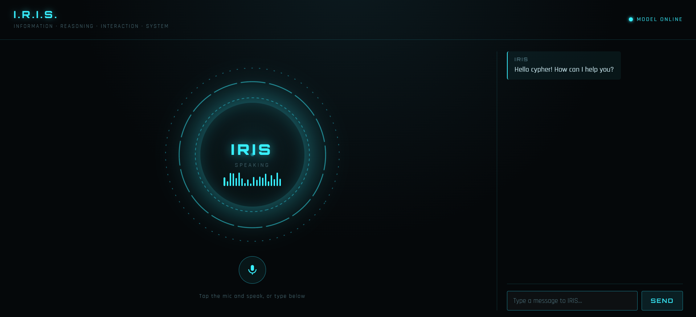

# IRIS 3.0



**IRIS = Information · Reasoning · Interaction · System**

A local personal AI assistant with:
- 🤖 Ollama + `qwen2.5:14b-instruct`
- 🧠 Persistent memory in `memory/memory.json`
- 🛠️ Python system tools
- 💬 Conversation context
- 🌐 Local web/voice interface

---

## 1. FIRST-TIME SETUP

Open a terminal **inside the IRIS folder**.

```bash
pip install -r requirements.txt
ollama pull qwen2.5:14b-instruct
```

Make sure Ollama is running:

```bash
ollama serve
```

> If Ollama is already running as a background service, do not start a second `ollama serve`.

---

## 2. RUN IRIS — TERMINAL

```bash
python main.py
```

You will see:

```text
IRIS: Hello ...
You:
```

Type your message:

```text
You: what is my favorite colour?
```

### Exit

```text
exit
```

or:

```text
quit
bye
```

---

## 3. RUN IRIS — FRONT END

Start the web server:

```bash
python server.py
```

Then open:

**http://127.0.0.1:5000**

### Front-end controls

| Action | How |
|---|---|
| Type | Enter message → **SEND** |
| Voice input | Click 🎙️ → speak |
| Voice output | IRIS speaks the reply |
| Status | `MODEL ONLINE` = Ollama reachable |
| Stop server | `Ctrl + C` in terminal |

Voice input works with **Chrome/Edge** using the browser Web Speech API.

---

## 4. HOW IRIS WORKS

```text
YOU
 │
 ├── Terminal → main.py
 │
 └── Browser → server.py → API
                         │
                         ▼
                    core/iris.py
                         │
              ┌──────────┼──────────┐
              ▼          ▼          ▼
           Actions     Memory     Tools
              │          │          │
              └──────────┼──────────┘
                         ▼
                       Ollama
                         │
                         ▼
                      RESPONSE
```

### Main files

| File | Purpose |
|---|---|
| `main.py` | Terminal interface |
| `server.py` | Local web server/API |
| `core/iris.py` | Main IRIS logic |
| `core/actions.py` | Detects memory/tool/question actions |
| `core/ollama.py` | Connects to Ollama |
| `core/context.py` | Recent conversation |
| `memory/manager.py` | Saves/updates/deletes memory |
| `memory/memory.json` | Persistent memory data |
| `tools/system_tools.py` | System information/tools |
| `static/index.html` | Front-end page |
| `static/style.css` | Front-end design |
| `static/app.js` | Front-end behavior/voice |

---

## 5. MEMORY

IRIS stores long-term information here:

```text
memory/memory.json
```

Examples:

```text
my name is John
my favorite colour is blue
I'm learning Linux
my mother's name is Mary
```

Useful commands to IRIS:

```text
What do you remember about me?
Change my name to John
Forget my favorite colour
```

**Important:** `memory.json` contains personal data. Back it up before editing or deleting it manually.

---

## 6. SYSTEM TOOLS

IRIS can answer live system questions such as:

```text
What is my RAM usage?
How much disk space do I have?
What is my CPU?
What is my hostname?
What is my IP address?
What Windows version am I using?
```

These are handled by Python tools rather than asking the AI to guess.

---

## 7. TROUBLESHOOTING

### Ollama error

```text
I can't connect to Ollama.
```

Check:

```bash
ollama list
```

Start Ollama:

```bash
ollama serve
```

Check the model:

```bash
ollama run qwen2.5:14b-instruct
```

### Web page not opening

Make sure this is running:

```bash
python server.py
```

Then open:

```text
http://127.0.0.1:5000
```

### Stop everything

In the terminal running IRIS/server:

```text
Ctrl + C
```

---

## 8. QUICK REFERENCE

### Terminal

```bash
pip install -r requirements.txt
ollama pull qwen2.5:14b-instruct
python main.py
```

### Front end

```bash
python server.py
```

Open:

```text
http://127.0.0.1:5000
```

### Ollama

```bash
ollama serve
ollama list
ollama run qwen2.5:14b-instruct
```

### Exit

```text
exit
```

---

## 9. SIMPLE RULE TO REMEMBER

```text
main.py   = Terminal IRIS
server.py = Browser IRIS
Ollama    = AI model
core/     = IRIS brain
memory/   = Long-term memory
tools/    = System information
static/   = Front end
```
